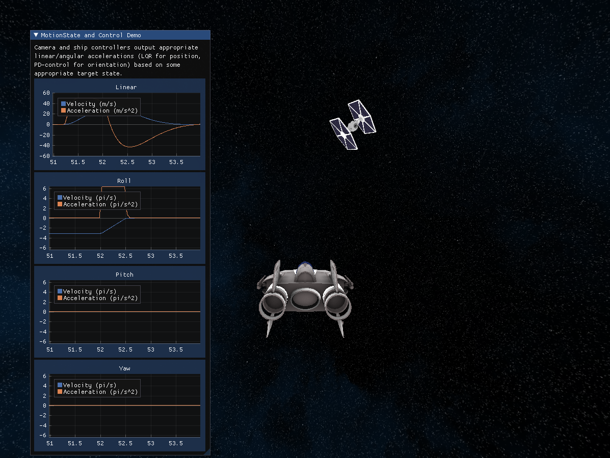

# AWingAlliance

A toy OpenGL project in C++ using SDL2 and Eigen3

[![Build Status][ci-badge]][ci-url]

## Dependencies

Here's a list of the external libraries used in this project.

| Library      | Description |
| :----------: | :---------: |
| [SDL2](https://github.com/libsdl-org/SDL)      | Simple Direct Media Layer |
| [GLEW](http://glew.sourceforge.net/)           | The OpenGL Extension Wrangler Library |
| [Eigen3](https://gitlab.com/libeigen/eigen)    | C++ template library for linear algebra |
| [EnTT](https://github.com/skypjack/entt)       | A fast and reliable entity component system (ECS) using modern C++ |
| [HFSM2](https://github.com/andrew-gresyk/HFSM2)| High-Performance Hierarchical Finite State Machine Framework |
| [Dear ImGui](https://github.com/ocornut/imgui) | Bloat-free Graphical User interface for C++ |
| [ImPlot](https://github.com/epezent/implot)    | Plotting library for Dear ImGui |
| [Assimp](https://github.com/assimp/assimp)     | Open-Asset-Importer-Library |
| [Alure](https://github.com/kcat/alure)         | A C++ utility library for OpenAL |
| [stb_image](https://github.com/nothings/stb)   | Single-file public domain C/C++ library for loading images |
| [yaml-cpp](https://github.com/jbeder/yaml-cpp) | A YAML parser and emitter in C++  |


## Installation

This assumes you are on a Linux system using the apt package manager.

Binary dependencies can be installed easily via apt.

```
sudo apt install build-essential cmake libsdl2-dev libglew-dev libeigen3-dev libassimp-dev libyaml-cpp-dev \
                 libopenal-dev libvorbis-dev libopusfile-dev libsndfile1-dev libompl-dev
```

## Cloning and building

Execute the following to clone and build the project.

```
git clone --recursive https://github.com/danielcranston/AWingAlliance
mkdir AWingAlliance/build && cd AWingAlliance/build
cmake -DCMAKE_BUILD_TYPE=Release ..
make -j
```


## Running

Run the main executable with `./awing` from the `build` folder.


[ci-badge]: https://img.shields.io/github/workflow/status/danielcranston/AWingAlliance/CMake/master
[ci-url]: https://github.com/danielcranston/AWingAlliance/actions/workflows/cmake.yml

## Screenshots and examples


